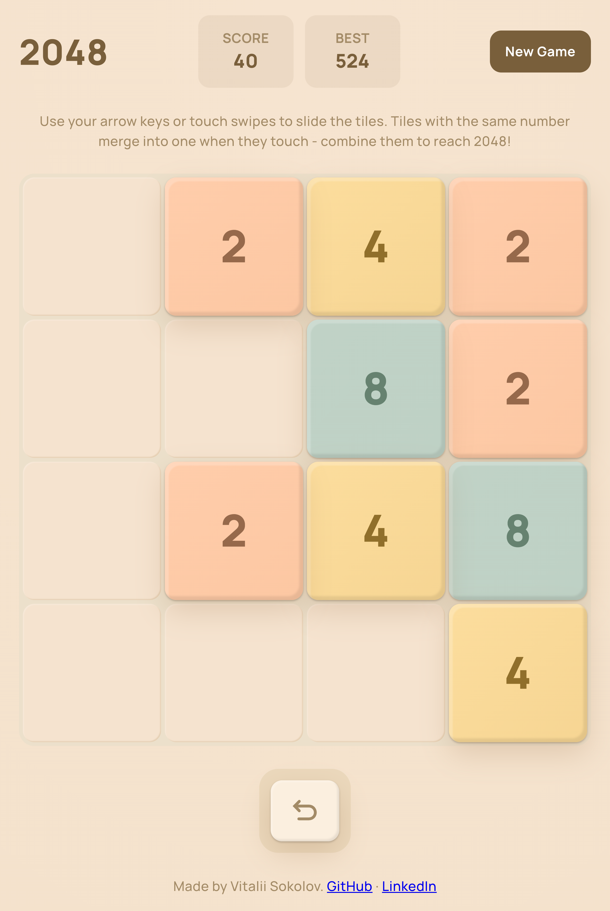

# 2048

A clean, dependency-free implementation of the classic **2048** sliding-tile puzzle.
Slide the tiles, merge matching numbers, and try to reach **2048**.

**▶ [Play the live demo](https://v-sokolov.github.io/2048-game/)**

<p align="left">
  
</p>

## What it is

A 4×4 grid of numbered tiles. Each move slides every tile as far as it can go.
When two tiles with the same number touch, they merge into one tile worth double.
A new tile spawns after every move that actually changes the board. Reach 2048 to
win. If no moves are left, the game is over.

Playable with the keyboard on desktop and with swipe gestures on touch devices, with
unlimited undo and a best score that survives page reloads.

## Features

- **4×4 board** with the full slide-and-merge rule set (one merge per tile per move).
- **Tile spawning** - a new `2` (90%) or `4` (10%) appears in a random empty cell after every valid move.
- **Scoring** - live score plus a **best score** persisted across sessions.
- **Win & game-over detection** - a "You win" state when the first 2048 tile appears, "Game over" when no moves remain.
- **New Game** - reset the board and score at any time.
- **Keyboard & touch** - arrow keys on desktop, swipe gestures on touchscreens.
- **Undo** - step back through the full move history.

## Tech stack

- **React 19** + **TypeScript** - and _no other runtime dependencies_. The game
  engine, state management, and input handling are all hand-written; there is no
  game framework, state library, or animation library.
- **Vite** for build/dev, **Vitest** + Testing Library for tests, **CSS Modules** for styling.

## Architecture at a glance

The code is split into layers, each with one job and a clear boundary:

```
services/engine/   Pure, framework-agnostic game logic (no React, no DOM)
        ↓
store/             A useReducer-based store: actions in, new state out
        ↓
hooks/             Input (keyboard / touch) and the useGame orchestration hook
        ↓
components/        Presentational React components - given state, render
```

A few decisions worth calling out:

- **Tiles are the source of truth, not the grid.** State is a flat `Tile[]`, each
  tile a stable `id` plus its `value`/`row`/`col`. The 2D board is a derived, transient
  `Grid<T>` (flat-backed) rebuilt only to compute a move. A stable identity is what lets
  tiles animate smoothly and lets merges be tracked correctly.
- **The engine is pure and framework-agnostic.** Every rule (move, merge, spawn,
  win/lose) is a plain function with no React or DOM dependency, so it's trivial to
  unit-test in isolation.
- **Data structures chosen on purpose.** A flat-backed `Grid<T>` for board reads. A
  `Set` of occupied cell indices, so "is the board full?" is O(1) and finding empty cells
  is O(t). A `Map` keyed by tile `id` that holds each tile's previous position, so a move
  counts as a real change only if some tile merged or actually moved. State flows through
  a `useReducer` store with typed actions, undo is a history stack of past states, and each
  move returns a `MoveResult` that carries merge events - ready to drive animations.
- **Built spec-first (SDD), then test-first (TDD).** Every feature started as a written spec
  and a failing test before any code. That may seem like a lot for a small game, but it keeps
  the layers clean and makes sure rules like powers-of-two values and end-game states are
  actually checked, not just assumed.

## Run it locally

**Prerequisites:** Node `24.13.0` (see [`.nvmrc`](.nvmrc)).

```bash
npm install      # install dependencies
npm run dev      # start the dev server (Vite)
npm test         # run the test suite (89 tests)
npm run build    # type-check (tsc --noEmit) and produce a production build
npm run preview  # serve the production build locally
```

Any package manager works (npm, yarn, or pnpm) - the scripts call the tools directly.

## Known limitations / Future ideas

- **Animation is movement-only.** Tiles slide smoothly to their new positions, but
  there's no "pop" effect when tiles merge or spawn. I prototyped one and decided to leave
  it out for now.
- **Undo isn't reflected in the URL or persisted** - history is in-memory and lost on reload.
- **Best score only** is persisted; the in-progress board is not, so a refresh starts a new game.
- **No keyboard focus management / ARIA** for the board - accessibility is a clear next step.
- **Move/history counter.** Surface a running count of moves played (and the available undo
  depth) next to the score, so the history stack the engine already tracks is visible to the player.
- **Move-direction flash.** On each move, briefly flash a subtle directional arrow - e.g. a
  ~50%-opacity icon that fades out after ~1s - to hint the direction the tiles just slid.
